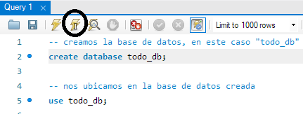
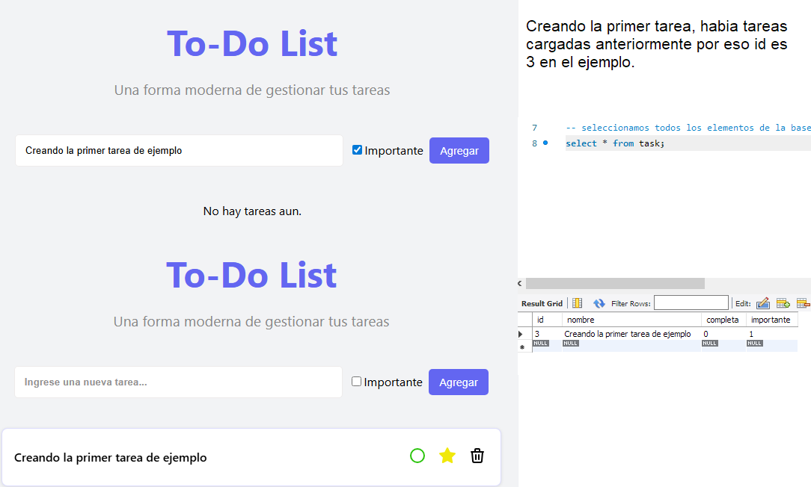
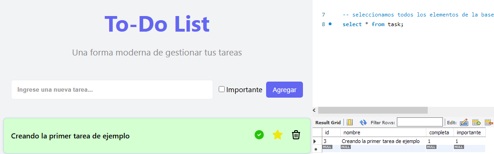
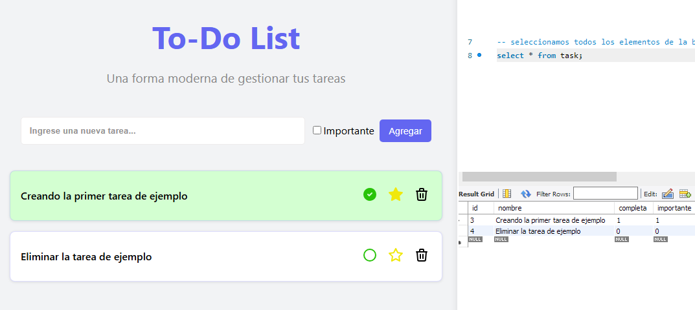
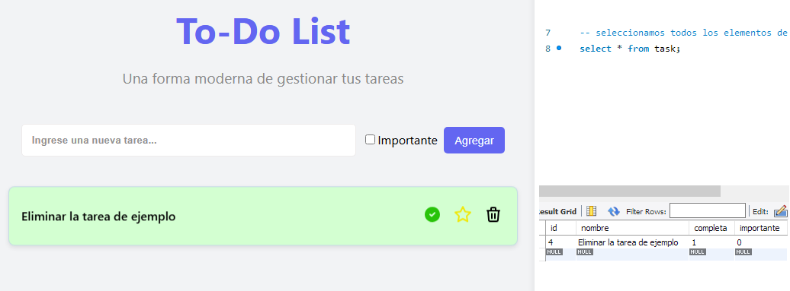

# 📋 To‑Do List – FastAPI + React + MySQL

Aplicación Full Stack para la gestión de tareas, compuesta por un backend en **FastAPI** que expone una API REST completa y un frontend en **React**. La aplicación utiliza **MySQL** como base de datos para almacenar las tareas y permite realizar todas las operaciones CRUD: crear, leer, actualizar y eliminar. Diseñada con una arquitectura modular, separación de capas y uso de controladores, servicios y repositorios.

---

## 🧱 Tecnologías

### 🔙 Backend
- **FastAPI** 
- **SQLAlchemy** 
- **Pydantic** 
- **Uvicorn** 
- **MySQL**  

### 🎨 Frontend
- **React** (HTML, CSS, JAVASCRIPT) 
- **Fetch API**
- **React Hooks**

---

## 🚀 Instalación
### Cómo ejecutar el scraper + Ejemplos

1. **Clonar el repositorio:**

   ```
   git clone https://github.com/EmmanuelYapura/scraping-musimundo.git "nombre_carpeta"
   cd "nombre_carpeta"
   ```

2. **Crear un entorno virtual:**

   ```
   python -m venv venv
   ```

   - Para Windows

   ```
   venv/Scripts/activate
   ```

   - Para Linux/macOs

   ```
   source venv/bin/activate
   ```

3. **Instala las dependencias :**

   ```
   pip install -r requirements.txt
   ```

4. Luego creamos un archivo .env para nuestras variables de entorno
   ```
      DATABASE_USER=root # o tu usuario
      DATABASE_PASSWORD=123456 # ejemplo usando docker punto 5
      DATABASE_NAME=todo_db # nombre a eleccion
   ```

5. **Crear base de datos para la conexion**

   Antes de ejecutar la aplicación, primero creamos la base de datos MySQL 
   
   Opción 1 : MySQL Workbench: herramienta de diseño y administración de bases de datos. Ejecutá los comandos SQL indicados uno por uno desde el botón de ejecución marcado. Recorda utilizar el mismo nombre de base en tu archivo .env

   

   
   Opción 2: 🐳 Docker (recomendado si no tenés MySQL instalado)
   
   en estas instrucciones vamos a crear la base usando un contenedor mysql en docker, con un usuario root a modo de prueba usando la imagen de mysql con la siguiente linea:

   ```
   docker run --name mysql-db -e MYSQL_ROOT_PASSWORD=123456 -p 3306:3306 mysql
   ```

   - Ingresar el password del cliente root para ingresar a la base de datos
   - Dentro de la terminal del contenedor de docker:

   ```
   mysql -p
   ```

   - 🔒 Importante: en la consola de docker la contrasena es invisible! 

   Podes continuar con los comandos de la imagen para la creacion de la base.
   No te olvides de modificar las variables de entorno!

6. Levantamos nuestra API 

   ```
   uvicorn app.main:app --reload
   ```

7. Levantamos nuestro frontend con React (En otra terminal)

   ```
   Primero ingresamos a la carpeta to-do-list-react
      cd to-do-list-react
   ```
   ```
   ejecutamos los comandos
      npm install
      npm run dev
   ```

8. Listo, ingresamos a la aplicacion y comenzamos a utilizar nuestro to-do-list

   ```
   http://localhost:5173/
   ```

9. Creación de una tarea (Ejemplo)

   

10. Actualización de una tarea

      

11. Eliminación de una tarea

      
      

---

## ▶️ Documentacion automatica

Accediendo a:

- `http://127.0.0.1:8000/docs` – Swagger UI interactivo  
- `http://127.0.0.1:8000/redoc` – Documentación con ReDoc

---

## 📡 Endpoints Basicos

- `GET /api/tasks` – Lista todas las tareas  
- `GET /api/tasks/{id}` – Obtiene una tarea por ID  
- `POST /api/tasks` – Crea una nueva tarea  
- `PUT /api/tasks/{id}/` – Actualiza una tarea existente  
- `DELETE /api/tasks/{id}/` – Elimina una tarea existente

---

## ⚙️ Estructura del proyecto

```
app/
├── controllers/               # Controladores: endpoints y rutas
├── repositories/              # Capa de acceso a datos
│   ├── models/                # Modelos ORM y conexión a la DB
│   │   └── database.py        # Configuración de MySQL
│   └── tasks_repository.py    # CRUD de tareas
├── schema/                    # Esquemas Pydantic
├── services/                  # Lógica de negocio
├── main.py                    # Punto de entrada FastAPI
to-do-list-react/              # Frontend con React
requirements.txt               # Dependencias
```

---

## 🤝 Contribuciones

¡Bienvenido! Podés contribuir generando issues, haciendo PRs o sugiriendo mejoras.  
En tu contribución, por favor detallá qué hiciste, chequeá el formato de código, y mantené las dependencias actualizadas.

---

## 👤 Autor

Desarrollado por **Emmanuel Yapura** –
